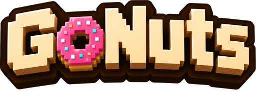

<div align="center">



### Trade the DonutSMP auction house on autopilot

GoNuts learns real prices from completed sales, hunts flips on both sides of the
market, and can run the whole play from bidding to reselling. Safety gated, and
off by default.

<table>
<tr>
<td align="center"><br><sub>Reading the market</sub></td>
<td align="center"><br><sub>Working a trade</sub></td>
<td align="center"><br><sub>A sale landed</sub></td>
<td align="center"><br><sub>Nothing to do</sub></td>
</tr>
</table>

*Meet your trading bot. It watches the market, bids, buys, and relists, and it lights up when a sale lands.*


</div>

---

## Why GoNuts

Most auction tooling reads the current asking prices and guesses. GoNuts does the
opposite: it collects every completed sale, builds its own long-term price
history, and values items from what things **actually sold for**, not what
someone is hoping to get. Then it puts that edge to work, and keeps adapting as
the market moves.

## What it does

|  |  |
|---|---|
| **Prices from real sales** | Recency-weighted percentiles, outlier filtering, a conservative quick-sale value, and manipulation checks that lower confidence instead of trusting a rigged market. |
| **Works both sides** | Ranks resale flips across dozens of markets, and reads and bids the **order house**, a book no public API exposes. |
| **Adapts live** | Benches markets that stop paying (on a rolling window, so they cycle back when they recover) and leans into the hours each market actually fills. |
| **Executes safely** | Buys exact-match listings and relists at a conservative target, booking a sale only after independent evidence reconciles it. Spend caps, dry run, emergency stop. Opt-in, off by default. |
| **Paper trades** | A leak-free simulated bankroll for backtesting before any real coin is at risk. |
| **Watches rivals** | Reconstructs who else is flipping, when they are active, and how they price. |
| **Scales to a clan** | One self-hosted server on a single Donut key, with per-member keys, so a whole hive trades on one budget and a shared, sharpening price history. |
| **Runs from Discord** | One live embed of the trader's state, with buttons to start, stop, and tune it. |

## See it in action

A full in-game control panel: opportunities, live markets, the order house,
rival intel, performance, and every setting, all in one screen you open with a
keypress.

> _GUI tour screenshots are on the way. They are captured in the mod's built-in
> demo mode, so they show the real interface with sample data, never a live
> account._

## Documentation

New here? Start with **Getting started**, then skim the **GUI tour** to see every
tab.

| Guide | What's inside |
|---|---|
| [Getting started](docs/getting-started.md) | Build, install the mod, and the first steps in order |
| [GUI tour](docs/gui-tour.md) | Every tab: what it shows, and why it is there |
| [How it works](docs/how-it-works.md) | The valuation and decision pipeline |
| [Configuration](docs/configuration.md) | API key, `config.json`, and the server allowlists |
| [Execution and safety](docs/execution-and-safety.md) | The trading modes and every permission gate |
| [Hive and clan server](docs/server.md) | One Donut key, many members |
| [Discord control panel](docs/discord.md) | Run the trader from a Discord channel |

## Quick start

Requires **JDK 25** (Minecraft 26.2). From the repo root:

```bash
./gradlew build
java -jar trader-cli/build/libs/doughbay.jar doctor
```

`doctor` validates the data pipeline against the live API without writing
anything. The Fabric mod jar lands in `trader-fabric/build/libs/`; drop it in
your `mods/` folder. Full walkthrough in [Getting started](docs/getting-started.md).

## Safety and honesty

GoNuts starts in **Observe** mode and cannot place a real trade until execution
is explicitly enabled and the current server is on an exact-address allowlist.
It aborts on any ambiguity rather than guessing, and it never conceals that it
is automated.

**DonutSMP's rules ban scripts, macros, and auto-clickers**, and enforcement can
reach every account linked to a player. The analysis, pricing, and paper-trading
features carry no such risk; running live execution is a choice to take a real
ban risk, made by the account owner. GoNuts is an independent project, not
affiliated with or endorsed by DonutSMP.

## License

[MIT](LICENSE).
